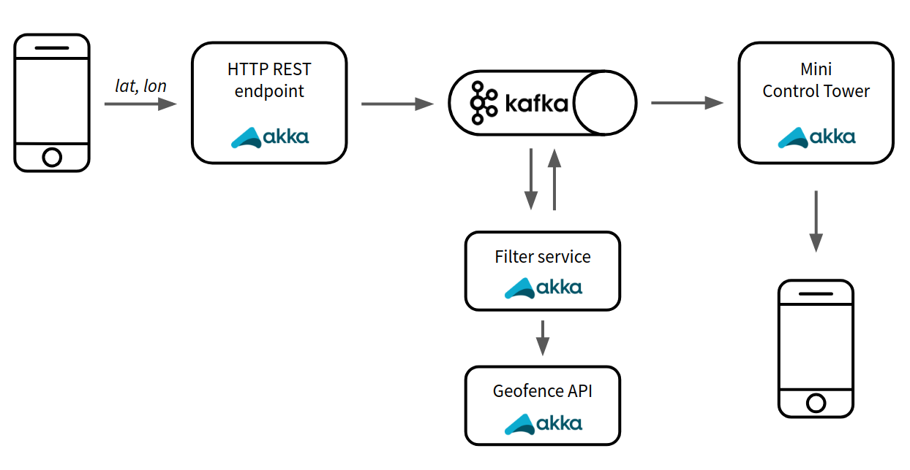

J-Fall demo services
====================

This repository contains five different services that together provide a demo application to show how Kafka works
together with Akka Streams, and shows how big data can be streamed without overloading any services.

Special thanks
-----------
I would like to thank everyone at Simacan for helping me out in the effort of creating these services. In particular an extended thanks to Bas Meesters, Bart Kummel, Jessica Siewert, Jeroen Ferdinandus and Werner Schram.

Application
-----------

**Overview**

This application allows you to send your coordinates from your phone to an HTTP endpoint using Akka HTTP. These
coordinates will be put on Kafka, read by a filter service that on its turn uses filters out all coordinates that are
not in the specified area using the Geofence API. Afterwards all filtered coordinates will be put on Kafka again that
are read by the Control Tower. This Control Tower saves all latest coordinates per phone that can be requested by some
frontend.

Services
--------

This demo application consists of:

* An http server that allows you to send coordinates from some device, either a single update, or a bulk updates at the
  same time. This service puts every update on Kafka and does nothing else.

* A filter service that determines whether an update of coordinates is within the specified area (using the geofence
  api). This service comes in two flavours, one with back pressure and one without. The one without will give
  timeouts if the amount of incoming coordinate updates of the http service is too high.

* The geofence API that determines whether an update is within the predetermined geofence and is made deliberately slow.

* The Control Tower that reads all filtered updates from Kafka and keeps the latest update per GPS device in memory so
  they can be requested by some frontend.

* The frontend that shows a map of the Netherlands and all incoming updates.

How to run
----------

Every Scala application has a Main that can be started from the command line (for instance, with SBT) or from an IDE such as
Intellij.

A frontend that can be started using NPM or Yarn.

To get it all up and running you also need to install Kafka and run it locally. [Confluent](https://www.confluent.io/)
is an easy to use client. Simply use `confluent start` (the topics will automatically be created). See the official
[quickstart guide](https://docs.confluent.io/current/quickstart/cos-quickstart.html) for some more information. Thereafter
you can start each of the applications separately and send updates to your endpoint.
